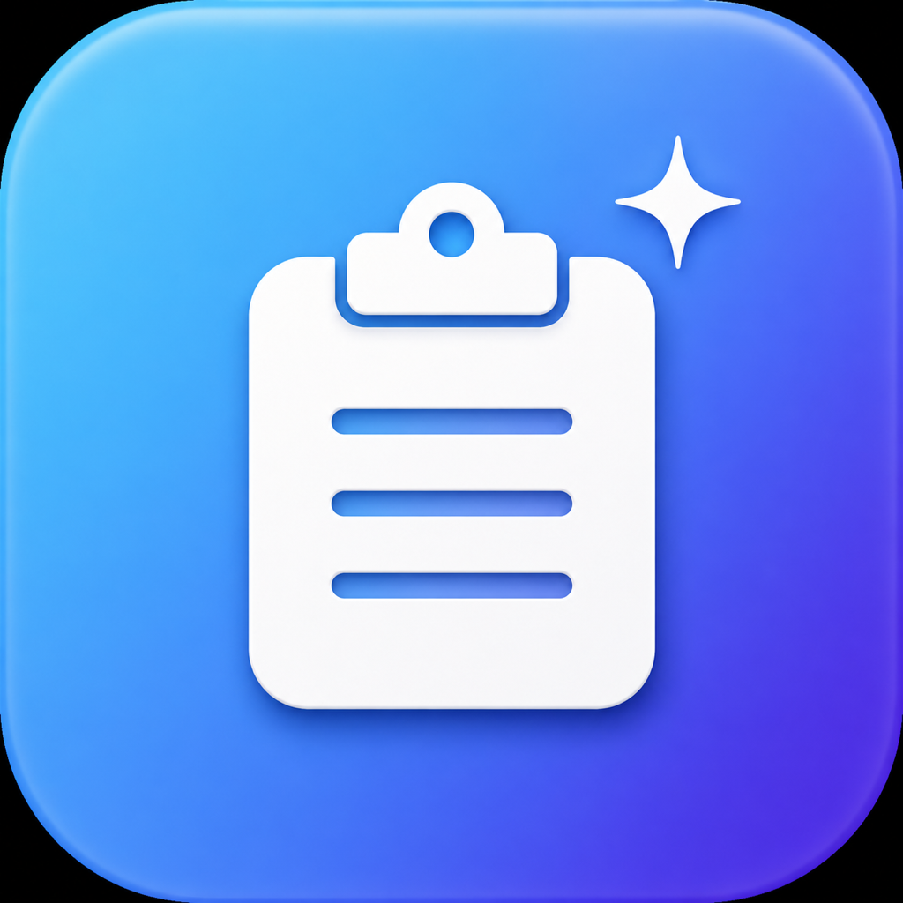

<p align="center">
  
</p>

# ClipTidy

A tiny macOS menu bar app that cleans messy copied text before you paste it.

Copy something out of your terminal and paste it into Discord, Slack, or a doc, and it often arrives broken: lines snapped into rows, spaces padded onto every row, indentation that turns into a stray code block. ClipTidy fixes the clipboard so the paste lands clean.

## Why I built this

I run two healthcare companies in the Philippines, and over the past year I have spent more and more time in the terminal, learning to build alongside AI coding tools instead of only steering from a dashboard.

That is where this came from. I would work an idea out in the terminal, a plan, a snippet, a few bullet points, then paste it to my team on Discord to talk it through. Every time, the paste landed broken. Lines chopped into rows. Spaces stuck to the front of each line. A clean three-line thought turned into noise nobody wanted to read.

So I built ClipTidy. It notices when the thing I copied came from a terminal and tidies it before I paste. Copy, paste, done. Everything else I copy, from a doc, a browser, a text file, it leaves alone.

Small problem, small tool. But it is the kind of friction that adds up, and fixing it myself was half the fun.

## What it does

- **Clean Clipboard Now** rewrites whatever is currently on your clipboard. Copy the messy text, click the menu bar icon, choose Clean, then paste.
- **Auto-clean on Copy** watches the clipboard while it is on. Every time you copy text from a terminal, it gets cleaned automatically. Just copy and paste, nothing else to click. By default it only acts on copies made from a terminal app, so text you copy from anywhere else is untouched.

Lives in the menu bar only. No Dock icon, no window.

## Modes

| Mode | What it does | Best for |
|------|--------------|----------|
| **Smart reflow** | Strips blockquote bars (`▌`, `>`), rejoins wrap-broken lines, keeps list items, blank lines, and URLs as real line breaks | Quoted AI answers, numbered lists, chat messages (the default) |
| **Join paragraphs** | Merges wrap-broken lines back into paragraphs, keeps blank lines as breaks | Plain prose |
| **Trim lines** | Strips leading and trailing spaces from every line, keeps line breaks | Lists, short snippets |
| **One line** | Collapses everything into a single space-separated line | A URL or command split across rows |
| **Code block** | Removes the terminal's left padding, keeps real indentation, wraps in ` ``` ` | Pasting code or logs into Discord |

Pick the mode from the menu. It applies to both the manual click and auto-clean.

## Install

Requires macOS 13 or later and the Swift toolchain (install Xcode or the Command Line Tools).

```sh
git clone <your-repo-url> cliptidy
cd cliptidy
make install
```

`make install` builds the app and copies it to `/Applications`. Open ClipTidy from Launchpad. A wand icon appears in your menu bar.

Other targets:

- `make app` builds `ClipTidy.app` in the project folder without installing.
- `make run` runs it straight from the build directory.
- `make build` compiles the binary only.

The app is unsigned. The first time you open it, macOS may warn you. Right-click the app and choose **Open**, or allow it under System Settings, Privacy and Security.

## Usage

1. Click the wand icon in the menu bar.
2. Turn on **Auto-clean on Copy** for hands-off cleaning, or leave it off and use **Clean Clipboard Now** when you need it.
3. Optionally turn on **Launch at Login** so it is always ready.

With auto-clean on, your flow is just: copy the messy text, paste it where you want it.

## Keyboard shortcuts

These work from anywhere, so you never need to find the menu bar icon (handy when the notch hides it):

| Shortcut | Action |
|----------|--------|
| **Control + Option + Command + C** | Clean the clipboard now (plays a short sound) |
| **Control + Option + Command + A** | Toggle auto-clean on or off (sound confirms the new state) |

The shortcuts use Carbon hot keys and need no Accessibility permission.

## A note on auto-clean

By default, auto-clean only touches copies that come from a terminal app (Ghostty, Terminal, iTerm, Warp, and others). Anything you copy from a text editor, browser, or any other app is left exactly as it was. ClipTidy knows the source because the frontmost app at the moment you copy is where the copy came from.

Turn off **Auto-clean from Terminals Only** if you want auto-clean to apply to every copy instead. In that mode it keeps only the plain text, so formatting from styled copies is dropped. Either way, the manual **Clean Clipboard Now** and its shortcut always work no matter where the text came from.

## Privacy

ClipTidy runs entirely on your Mac. It reads the clipboard and checks which app is in front when you copy, and that is all. There is no network code, no analytics, and nothing ever leaves your machine. It needs no special permissions. The whole app is a few hundred lines you can read in one sitting.

## How it works

A timer checks the clipboard's change count a few times a second. When it changes, ClipTidy reads the plain text, runs it through the selected cleaner, and writes it back, recording its own write so it never reprocesses itself. For auto-clean, it also checks the frontmost application's bundle identifier against a list of known terminals (see `terminalBundleIDs` in `AppController.swift`), which is how it tells terminal copies from everything else. All the text transforms live in `Sources/ClipTidy/Cleaner.swift` and have no UI or clipboard dependencies, so they are easy to read, change, and reuse.

## Contributing

Pull requests welcome. The whole app is three small Swift files:

- `Cleaner.swift` is the pure text logic.
- `AppController.swift` is the menu bar item, preferences, and clipboard watcher.
- `main.swift` is the entry point.

Add a new cleaning mode by adding a case to `CleanMode` and a method in `Cleaner`. The menu builds itself from the enum.

## About

Built by Dennis Seymour ([@denseymour](https://github.com/denseymour)). If you want to see what my teams ship:

- **[SeriousMD](https://seriousmd.com)**: EMR and practice management for doctors and clinics.
- **[NowServing](https://nowserving.ph)**: find and book doctors across the Philippines.
- **[NowExpress](https://nowexpress.ph)**: order medicine and get it delivered.

## License

MIT. See [LICENSE](LICENSE).
